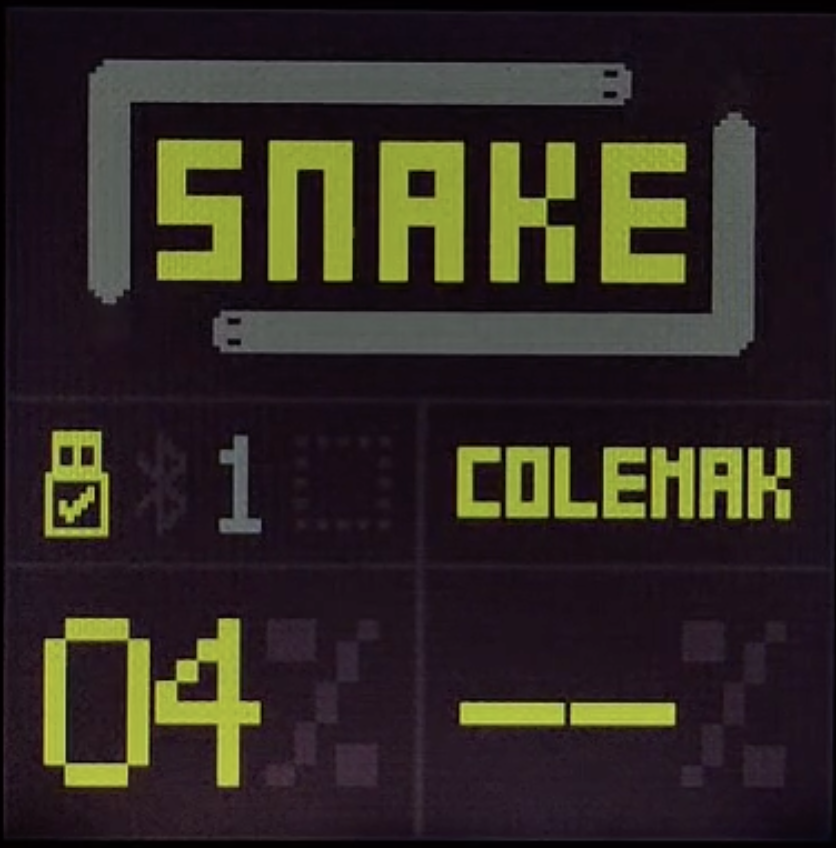
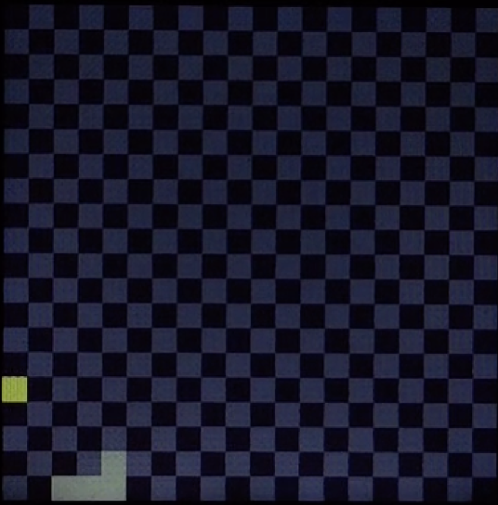
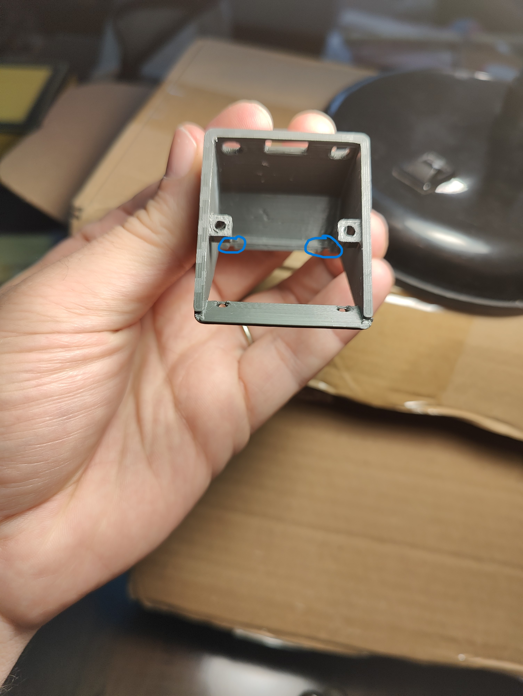

<div align="center">


</div>

Snake Dongle is a compact, highly customizable ZMK-powered dongle that features a Snake‑game-style animation and optional sound effects.

## Contents
- [Features & Behavior](#features--behavior-)
- [Themes](#themes-)
- [Firmware Installation](#firmware-installation-)
- [Configuration Options](#configuration-options-)
- [Example configuration file](#example-configuration-file-)
- [Bill of Materials](#bill-of-materials-)
- [Optional Materials](#optional-materials-)
- [Wiring Diagram](#wiring-diagram-)
- [Build log](#build-log-)
- [Credits](#credits-)

## Features & Behavior [🔼](#contents)

Snake Dongle has a "action" button that when:
- **Pressed**: Toggles between main menu and snake animation.
- **Held**: Changes to next theme.
- **Held a little more**: (Un)Mutes the buzzer.

> [!NOTE]
> To change the interval for changing themes, set the desired duration in milliseconds on variable `CONFIG_THEME_THRESHOLD`.
> To change the interval for (un)mute, set the desired duration in milliseconds on variable `CONFIG_MUTE_THRESHOLD`.

> [!CAUTION]
> `CONFIG_MUTE_THRESHOLD` **MUST** be greater than `CONFIG_THEME_THRESHOLD`. If not, your configuration won't work and default values will be used.

This dongle also includes three screens in its interface:

- **Splash Screen** — displays the logo while hardware initializes.
- **Snake Animation** — a simple snake moves around, “eating” food to grow.
- **Main Menu** — shows operational status:
  - Battery connection state.
  - Battery level.
  - Active layer or selected theme (controlled via `CONFIG_SHOW_ACTIVE_LAYER` variable).
  - Transport mode (Bluetooth or wired).
  - Active Bluetooth profile.
  - Animated snake logo.

## Themes [🔼](#contents)

Only Theme C is customizable. If `CONFIG_USE_COMPLETE_CUSTOM_THEME=y`, all variables after "# complete theme settings" comment on [example file](#example-configuration-file-) are used; otherwise, the `CONFIG_THEME_[COLOR TYPE]_COLOR` variables are used.

> [!NOTE]
> BG on variable names stands for "Background" which is the background color of a font or sprite.

<table>
    <tr>
        <th>Animation</th>
        <th>Menu</th>
        <th>Num</th>
        <th>Link</th>
    </tr>
    <tr>
        <td></td>
        <td></td>
        <td>Skin C</td>
        <td>Complete custom theme made by chat gpt</td>
    </tr>
    <tr>
        <td></td>
        <td></td>
        <td>Skin 01</td>
        <td><a href="https://lospec.com/palette-list/nostalgia">nostalgia palette</a></td>
    </tr>
    <tr>
        <td></td>
        <td></td>
        <td>Skin 02</td>
        <td><a href="https://lospec.com/palette-list/b4sement">b4sement</a></td>
    </tr>
    <tr>
        <td></td>
        <td></td>
        <td>Skin 03</td>
        <td><a href="https://lospec.com/palette-list/kirokaze-gameboy">kirokaze gameboy</a></td>
    </tr>
    <tr>
        <td></td>
        <td></td>
        <td>Skin 04</td>
        <td><a href="https://lospec.com/palette-list/moonlight-gb">moonlight-gb</a></td>
    </tr>
    <tr>
        <td></td>
        <td></td>
        <td>Skin 05</td>
        <td><a href="https://lospec.com/palette-list/cherrymelon">cherrymelon</a></td>
    </tr>
    <tr>
        <td></td>
        <td></td>
        <td>Skin 06</td>
        <td><a href="https://lospec.com/palette-list/bittersweet">bittersweet</a></td>
    </tr>
    <tr>
        <td></td>
        <td></td>
        <td>Skin 07</td>
        <td><a href="https://lospec.com/palette-list/lava-gb">lava-gb</a></td>
    </tr>
    <tr>
        <td></td>
        <td></td>
        <td>Skin 08</td>
        <td><a href="https://lospec.com/gallery/dogmaster/cave">cave</a></td>
    </tr>
    <tr>
        <td></td>
        <td></td>
        <td>Skin 09</td>
        <td>Eva 01 neon genesis evangelion</td>
    </tr>
    <tr>
        <td></td>
        <td></td>
        <td>Skin 10</td>
        <td>neon colors</td>
    </tr>
</table>

## Firmware Installation [🔼](#contents)

Your ZMK keyboard should be set up with a dongle as central. [This](https://github.com/joaopedropio/zmk-swoop) repo may help you in case you run into trouble. 

Add this module to your `config/west.yml` with these new entries under `remotes` and `projects`:

```yaml
manifest:
  remotes:
    - name: zmkfirmware
      url-base: https://github.com/zmkfirmware
    - name: joaopedropio                          # <--- add these
      url-base: https://github.com/joaopedropio   # <---
  projects:
    - name: zmk
      remote: zmkfirmware
      revision: main
      import: app/west.yml
    - name: snake-module                          # <--- and these
      remote: joaopedropio                        # <---
      revision: master                            # <---
  self:
    path: config
```

Then add the `snake_adapter` shield to the dongle in your `build.yaml`:

```yaml
---
include:
  - board: nice_nano_v2                                  # <--- add these
    shield: [YOUR KEYBOARD SHIELD]_dongle snake_adapter  # <---
    artifact-name: snake_dongle                          # <---
  - board: nice_nano_v2
    shield: swoop_left
    artifact-name: swoop_left
  - board: nice_nano_v2
    shield: swoop_right
    artifact-name: swoop_right
  - board: nice_nano_v2
    shield: settings_reset
    artifact-name: settings_reset
```

For more information on ZMK Modules and building locally, see [the ZMK docs page on modules.](https://zmk.dev/docs/features/modules)

## Configuration Options [🔼](#contents)

| Variable | Values | Default | Description |
| --------- | ----------- | ----- | ----- |
| `CONFIG_SNAKE_FATNESS` | Any number above 0 | 1 | Amount the snake grows per food (if value is 0, the snake will not grow and walk forever? 🤯) |
| `CONFIG_SNAKE_BOARD_SIZE` | <ul><li>"XS" `8x8`</li><li>"S" `10x10`</li><li>"M" `12x12`</li><li>"L" `16x16`</li><li>"XL" `20x20`</li><li>"XXL" `24x24`</li><li>"XXXL" `48x48`</li></ul>| "XL" |  Animation grid size. For example, "XS" will show a board with 8 of height and 8 of width |
| `CONFIG_SNAKE_WALK_INTERVAL` | Any number above 0 | 20 | Minimum milliseconds between animation updates. Using a value too low can make the dongle unasable since the cpu usage will be very high |
| `CONFIG_CHECKERED_BOARD` | y or n | y | Print the board like a chess board. If disabled, the board will have just one color, which I think makes the screen too empty |
| `CONFIG_WPM_SLOW` | Any number above 0 | 20 | Threshold WPM to refresh animation faster by 4x the walk interval |
| `CONFIG_WPM_MEDIUM` | Any number above `CONFIG_WPM_SLOW` | 40 | Threshold WPM to refresh animation faster by 3x the walk interval |
| `CONFIG_WPM_FAST` | Any number above `CONFIG_WPM_MEDIUM` | 80 | Threshold WPM to refresh animation faster by 2x the walk interval |
| `CONFIG_WPM_SUPER_FAST` | Any number above `CONFIG_WPM_FAST` | 90 | Threshold WPM to refresh animation faster by 1x the walk interval |
| `CONFIG_USE_BUZZER` | y or n | y | Enable sound effects. You can (dis)enable each of the sound with the following variables |
| `CONFIG_USE_FOOD_SOUND` | y or n | n | Enable sound when snake eats food |
| `CONFIG_USE_DIE_SOUND` | y or n | n | Enable sound when snake dies |
| `CONFIG_USE_THEME_SOUND` | y or n | n | Enable sound when changing themes |
| `CONFIG_USE_MENU_SOUND` | y or n | n | Enable sound when you change screens |
| `CONFIG_USE_STATUS_SOUND` | y or n | n | Enable sound when (dis)connecting peripherals |
| `CONFIG_THEME_THRESHOLD` | Any number above 0 | 300 | Action button hold time to change to next theme |
| `CONFIG_MUTE_THRESHOLD` | Any number above `CONFIG_THEME_THRESHOLD` | 600 | Action button hold time to (un)mute |
| `CONFIG_DEFAULT_SCREEN` | <ul><li>"snake"</li><li>"status"</li></ul> | "snake" | The screen that is displayed right after the splash screen |
| `CONFIG_LOGO_WALK_INTERVAL` | Any number above 0 | 40 | Time in ms between each refresh of the snake logo animation |
| `CONFIG_SHOW_ACTIVE_LAYER` | y or n | y | Shows active layer on menu screen. If disabled, show the current theme instead |
| `CONFIG_SPLASH_USE_SNAKE_2` | y or n | n | Use the "Snake 2" logo or just the default dongle logo which is just "snake" |
| `CONFIG_USE_COMPLETE_CUSTOM_THEME` | y or n | n | Enable using basic theme or complete theme on custom theme slot. If `n`, the `CONFIG_THEME_[COLOR TYPE]_COLOR` variables will be used as theme. If `y`, all the variables bellow "complete theme settings" comment on the [file](#example-configuration-file-) bellow will be used as theme |

## Example configuration file [🔼](#contents)

```ini
# configure snake game
CONFIG_SNAKE_FATNESS=1
# default: 1
CONFIG_SNAKE_BOARD_SIZE="XL"
# default: "XL". Options: "XS", "S", "M", "L", "XL", "XXL", "XXXL"
CONFIG_SNAKE_WALK_INTERVAL=20
# default: 20 (in milliseconds)
CONFIG_CHECKERED_BOARD=y
# default: y
CONFIG_WPM_SLOW=20
# default: 20
CONFIG_WPM_MEDIUM=40
# default: 40
CONFIG_WPM_FAST=80
# default: 80
CONFIG_WPM_SUPER_FAST=90
# default: 90

# configure sound
CONFIG_USE_BUZZER=y
# default: y
CONFIG_USE_FOOD_SOUND=y
# default: n
CONFIG_USE_DIE_SOUND=y
# default: n
CONFIG_USE_THEME_SOUND=y
# default: n
CONFIG_USE_MENU_SOUND=y
# default: n
CONFIG_USE_STATUS_SOUND=y
# default: y

# configure other
CONFIG_THEME_THRESHOLD=300
# default: 300 (in milliseconds)
CONFIG_MUTE_THRESHOLD=600
# default: 600 (in milliseconds)
CONFIG_DEFAULT_SCREEN="snake"
# default: "snake". Options: "snake", "status"
CONFIG_LOGO_WALK_INTERVAL=40
# default: 40 (in milliseconds)
CONFIG_SHOW_ACTIVE_LAYER=n
# default: y

# configure theme
CONFIG_USE_COMPLETE_CUSTOM_THEME=y
# default: n
CONFIG_SPLASH_USE_SNAKE_2=y
# default: n

# basic theme settings
# https://lospec.com/palette-list/voltage-warning
CONFIG_THEME_PRIMARY_COLOR="77888c"
CONFIG_THEME_SECONDARY_COLOR="4f5a64"
CONFIG_THEME_BG_COLOR="3b4152"
CONFIG_THEME_BG_DARKER_COLOR="393849"

# complete theme settings
# created by chat gpt
CONFIG_SPLASH_LOGO_COLOR="#FF6B81"
CONFIG_SPLASH_CREATED_BY_COLOR="#7FDBFF"
CONFIG_SPLASH_BG_COLOR="#212121"
CONFIG_SNAKE_DEFAULT_COLOR="#00FFC6"
CONFIG_SNAKE_BOARD_COLOR="#004643"
CONFIG_SNAKE_BOARD_1_COLOR="#00ADB5"
CONFIG_FOOD_COLOR="#FF9F1C"
CONFIG_SNAKE_COLOR_0="#FF206E"
CONFIG_SNAKE_COLOR_1="#FB5607"
CONFIG_SNAKE_COLOR_2="#8338EC"
CONFIG_SNAKE_COLOR_3="#3A86FF"
CONFIG_SNAKE_COLOR_4="#6A4C93"
CONFIG_SNAKE_COLOR_5="#B5179E"
CONFIG_SNAKE_COLOR_6="#80ED99"
CONFIG_BATTERY_NUM_COLOR="#FF8C00"
CONFIG_BATTERY_PERCENTAGE_COLOR="#66FF66"
CONFIG_BATTERY_BG_COLOR="#212121"
CONFIG_BATTERY_NUM_COLOR_1="#FF8C00"
CONFIG_BATTERY_PERCENTAGE_COLOR_1="#66FF66"
CONFIG_BATTERY_BG_COLOR_1="#212121"
CONFIG_SYMBOL_SELECTED_COLOR="#FFD700"
CONFIG_SYMBOL_UNSELECTED_COLOR="#8D99AE"
CONFIG_SYMBOL_BG_COLOR="#212121"
CONFIG_BT_NUM_COLOR="#06D6A0"
CONFIG_BT_BG_COLOR="#212121"
CONFIG_BT_STATUS_OK_COLOR="#28A745"
CONFIG_BT_STATUS_NOT_OK_COLOR="#DC3545"
CONFIG_BT_STATUS_OPEN_COLOR="#FFD166"
CONFIG_BT_STATUS_BG_COLOR="#212121"
CONFIG_THEME_FONT_COLOR="#A0A0A0"
CONFIG_THEME_FONT_COLOR_1="#E0E0E0"
CONFIG_THEME_BG_COLOR="#212121"
CONFIG_LAYER_FONT_COLOR="#E0E0E0"
CONFIG_LAYER_FONT_BG_COLOR="#212121"
CONFIG_LOGO_FONT_COLOR="#FF4D6D"
CONFIG_LOGO_SNAKE_COLOR="#00C896"
CONFIG_LOGO_BG_COLOR="#212121"
CONFIG_FRAME_COLOR="#FEE440"
CONFIG_FRAME_COLOR_1="#3C1642"
CONFIG_MENU_BG_COLOR="#212121"
```

## Bill of Materials [🔼](#contents)

<table>
    <tr>
        <th>Image</th>
        <th>Part Name</th>
        <th>Count</th>
        <th>Links</th>
        <th>Notes</th>
    </tr>
    <tr>
        <td><a href="https://github.com/joaopedropio/snake-dongle/blob/master/images/bom/case.png"></a></td>
        <td>3D-printed case</td>
        <td>1x</td>
        <td><a href="https://github.com/joaopedropio/snake-dongle-shell/tree/master">stl files</a></td>
        <td>A friend printed this to me so I can't tell what configuration or fillament was used.</td>
    </tr>
    <tr>
        <td><a href="https://github.com/joaopedropio/snake-dongle/blob/master/controller.png"></a></td>
        <td>Pro Micro nRF52840</td>
        <td>1x</td>
        <td><a href="https://pt.aliexpress.com/item/1005009890354737.html">aliexpress</a></td>
        <td>A nice nano v2 <i>may</i> work but I can't say for sure because I don't have one to test</td>
    </tr>
    <tr>
        <td><a href="https://github.com/joaopedropio/snake-dongle/blob/master/images/bom/screen.png"></a></td>
        <td>DIYTZT 1.54" TFT 240x240 ST7789 Display Module </td>
        <td>1x</td>
        <td><a href="https://pt.aliexpress.com/item/1005008723433125.html">aliexpress</a></td>
        <td></td>
    </tr>
    <tr>
        <td><a href="https://github.com/joaopedropio/snake-dongle/blob/master/images/bom/button.png"></a></td>
        <td>4 Pin 6x6x8 Push Button</td>
        <td>2x</td>
        <td><a href="https://pt.aliexpress.com/item/1005007623070623.html">aliexpress</a></td>
        <td>Any 6x6mm push button may do. I prefer at least 8mm of height because this minimum to be able to push without using any tool.</td>
    </tr>
    <tr>
        <td><a href="https://github.com/joaopedropio/snake-dongle/blob/master/images/bom/screw.png"></a></td>
        <td>M2 5mm Head Screw</td>
        <td>6x</td>
        <td><a href="https://pt.aliexpress.com/item/1005006169144670.html">aliexpress</a></td>
        <td>Can be any length above 5mm.</td>
    </tr>
    <tr>
        <td><a href="https://github.com/joaopedropio/snake-dongle/blob/master/images/bom/insert.png"></a></td>
        <td>M2x3x3.5 Heat Brass Insert</td>
        <td>2x</td>
        <td><a href="https://pt.aliexpress.com/item/1005003582355741.html">aliexpress</a></td>
        <td>Hold the base in place. Can be any length but must be M2.</td>
    </tr>
    <tr>
        <td><a href="https://github.com/joaopedropio/snake-dongle/blob/master/images/bom/nut.png"></a></td>
        <td>M2 Hex Nut</td>
        <td>2x</td>
        <td><a href="https://pt.aliexpress.com/item/1005007593861199.html">aliexpress</a></td>
        <td>Hold the screen in place. If you don't want to buy this, you can use M2 brass insert as well, will work fine.</td>
    </tr>
</table>

### Optional Materials [🔼](#contents)

<table>
    <tr>
        <th>Image</th>
        <th>Part Name</th>
        <th>Count</th>
        <th>Links</th>
        <th>Notes</th>
    </tr>
    <tr>
        <td><a href="https://github.com/joaopedropio/snake-dongle/blob/master/images/bom/bom/buzzer.png"></a></td>
        <td>Passive Buzzer</td>
        <td>1x</td>
        <td><a href="https://pt.aliexpress.com/item/1005005528181661.html">aliexpress</a></td>
        <td>MUST be passive. If you buy the active buzzer, it will produce just noise.</td>
    </tr>
    <tr>
        <td><a href="https://github.com/joaopedropio/snake-dongle/blob/master/images/bom/tape.png"></a></td>
        <td>1cm Double-Sided Tape</td>
        <td>1x</td>
        <td><a href="https://pt.aliexpress.com/item/1005009024287891.html">aliexpress</a></td>
        <td>Just to hold the buzzer module on the case.</td>
    </tr>
    <tr>
        <td><a href="https://github.com/joaopedropio/snake-dongle/blob/master/images/bom/trimpot.png"></a></td>
        <td>Trimpot 500R</td>
        <td>1x</td>
        <td><a href="https://pt.aliexpress.com/item/1005006157105408.html">aliexpress</a></td>
        <td>Any kind of resistor/potentiometer will do. This allows you to control buzzer volume. Not required. Without one, the volume will be always 100%.</td>
    </tr>
</table>

## Wiring Diagram [🔼](#contents)

</embed>

## Build log [🔼](#contents)

> [!CAUTION]
> I **strongly** suggest flashing the firmware rigth from the start and connecting it to the computer as you go so you can make sure the assembly is going fine and if something goes wrong you can fix as soon as possible. Trust me: if something goes wrong, disassembling everything to debug will be much harder.

<table>
    <tr>
        <th>Step</th>
        <th>Image</th>
        <th>Notes</th>
    </tr>
    <tr>
        <td>01</td>
        <td><a href="https://github.com/joaopedropio/snake-dongle/blob/master/images/build/build1.jpg"></a></td>
        <td>This is basically the material needed to build.</td>
    </tr>
    <tr>
        <td>02</td>
        <td><a href="https://github.com/joaopedropio/snake-dongle/blob/master/images/build/build00.jpg"></a></td>
        <td>I would suggest you first sand these parts so the push buttons and the base fit perfectly.</td>
    </tr>
    <tr>
        <td>03</td>
        <td><a href="https://github.com/joaopedropio/snake-dongle/blob/master/images/build/build0.jpg"></a></td>
        <td>Place the heat brass inserts. I did at this at nearly the of the build. Doing it right from the start is much easier.</td>
    </tr>
    <tr>
        <td>04</td>
        <td><a href="https://github.com/joaopedropio/snake-dongle/blob/master/images/build/build2.jpg"></a></td>
        <td>Solder the wires to the display. I placed a silicon to the front part of the display so this part can be flat and fit the case perfectly.</td>
    </tr>
    <tr>
        <td>05</td>
        <td><a href="https://github.com/joaopedropio/snake-dongle/blob/master/images/build/build3.jpg"></a></td>
        <td>I would suggest to cut wires about this size ou a little bit more. If the wires are too short the controller might not sit well on the base. If the wires are too long they might not fit inside the case later, even more so if you decide to use the buzzer (which is totally optional).</td>
    </tr>
    <tr>
        <td>06</td>
        <td><a href="https://github.com/joaopedropio/snake-dongle/blob/master/images/build/build4.jpg"></a></td>
        <td>This is the front part after soldering.</td>
    </tr>
        <td>07</td>
        <td><a href="https://github.com/joaopedropio/snake-dongle/blob/master/images/build/build17.jpg"></a></td>
        <td>Desolder the hearder pins and solder new wires to the buzzer module. Solder the potentiometer/trimpot/resistor to the VCC hole. I applied some super glue to hold the trimpot in place and avoid strees on the trimpot leg that is soldered.</td>
    </tr>
    <tr>
        <td>08</td>
        <td><a href="https://github.com/joaopedropio/snake-dongle/blob/master/images/build/build16.jpg"></a></td>
        <td>I soldered a trimpot facing down so I can level up/down the buzzer easielly if I want to. This is the place where we are going to tie the module further.</td>
    </tr>
    <tr>
        <td>09</td>
        <td><a href="https://github.com/joaopedropio/snake-dongle/blob/master/images/build/build5.jpg"></a></td>
        <td>Solder the display to the microcontroller. Pay attention to the wiring diagram. This chip has 3 ground and 1 VCC pin so some wires will have to be soldered together. The soldering station really helped with this project so I would suggest you to use one.</td>
    </tr>
    <tr>
        <td>10</td>
        <td><a href="https://github.com/joaopedropio/snake-dongle/blob/master/images/build/build6.jpg"></a></td>
        <td>This is all the parts soldered.</td>
    </tr>
    <tr>
        <td>11</td>
        <td><a href="https://github.com/joaopedropio/snake-dongle/blob/master/images/build/build7.jpg"></a></td>
        <td>For me, this was the hardest step. This case is really small. So it's hard to bring together the hex nut, display case and screw on this deep spot. I was not able to hold the hex nut in place.</td>
    </tr>
    <tr>
        <td>12</td>
        <td><a href="https://github.com/joaopedropio/snake-dongle/blob/master/images/build/build8.jpg"></a></td>
        <td>The solution was to hold the hex nut to the display with tape.</td>
    </tr>
    <tr>
        <td>13</td>
        <td><a href="https://github.com/joaopedropio/snake-dongle/blob/master/images/build/build9.jpg"></a></td>
        <td>The bottom hex nut was easier to screw so no tape needed.</td>
    </tr>
    <tr>
        <td>14</td>
        <td><a href="https://github.com/joaopedropio/snake-dongle/blob/master/images/build/build10.jpg"></a></td>
        <td>Now the screen is installed. The following 2 steps are for placing the buzzer to the back of the case so it's possible to level up or down the buzzer volume.</td>
    </tr>
    <tr>
        <td>15</td>
        <td><a href="https://github.com/joaopedropio/snake-dongle/blob/master/images/build/build11.jpg"></a></td>
        <td>Put a piece of the double-sided tape on the bottom of the module and remove the plastic protection.</td>
    </tr>
    <tr>
        <td>16</td>
        <td><a href="https://github.com/joaopedropio/snake-dongle/blob/master/images/build/build12.jpg"></a></td>
        <td>Place the buzzer module very deep into the case so the module does not block the USB/push buttons holes.</td>
    </tr>
    <tr>
        <td>17</td>
        <td><a href="https://github.com/joaopedropio/snake-dongle/blob/master/images/build/build13.jpg"></a></td>
        <td>Carefully fit all wires inside the case and put the push buttons in their places.</td>
    </tr>
    <tr>
        <td>18</td>
        <td><a href="https://github.com/joaopedropio/snake-dongle/blob/master/images/build/build14.jpg"></a></td>
        <td>Close the case screwing the base.</td>
    </tr>
    <tr>
        <td>19</td>
        <td><a href="https://github.com/joaopedropio/snake-dongle/blob/master/images/build/build15.jpg"></a></td>
        <td>And it's done! Now the only thing left to do is to pair your keyboard with the dongle and have fun with you new snake pet! 🐍</td>
    </tr>
</table>

## Credits [🔼](#contents)

- My wife: patience and designing the [snake case](https://github.com/joaopedropio/snake-dongle-shell).
- Members of the ZMK Discord: awnsering lots of questions.
- [This](https://makerworld.com/pt/models/496738-zmk-display-dongle#profileId-411073) dongle: case inspiration.
- [This](https://github.com/tokyo2006/zmk-config-oddball) repo from [tokyo2006](https://github.com/tokyo2006): dongle display widget code.
- [Prospector](https://github.com/carrefinho/prospector) from [Carrefinho](https://github.com/carrefinho): module code and ST7789 driver.
- [Cygnus](https://github.com/juhakaup/keyboards/tree/main/Cygnus%20v1.0) repo from [juhakaup](https://github.com/juhakaup): REAMDE inspiration.